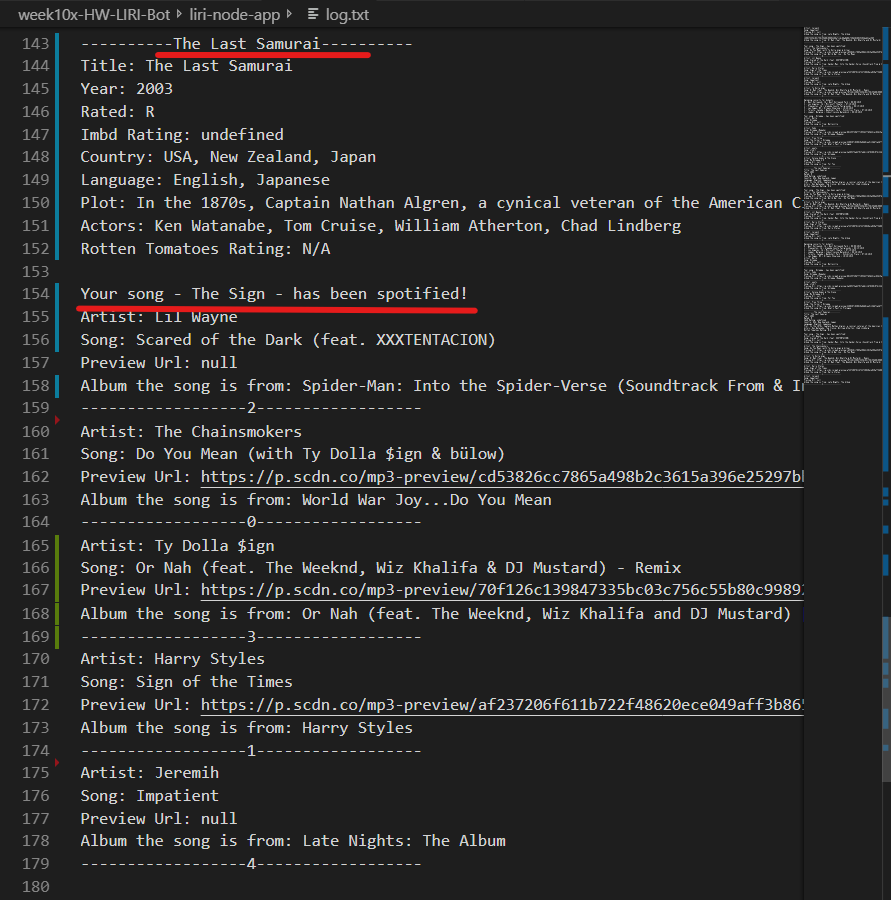

# liri-node-app
Language Interpretation and Recognition Interface (LIRI) command line node app. Think SIRI for written text instead of speech. 

SIRI *speech interpretation and recognition interface*.

## LIRI's functionality

### 1. LIRI understands the following commands:
    node    | liri.js |     process.argv[2]     | process.argv[3]
    --------|---------|-------------------------|----------------
    1. node | liri.js |    concert-this         | 'artist/band name' 
    2. node | liri.js |    spotify-this-song    | 'song name'
    3. node | liri.js |    movie-this           | 'movie name'
    4. node | liri.js |    do-what-it-says      |

**Commands LIRI understands**
;

### 2. What each commands does:
1. `node liri.js concert-this <artist/band name here>`
Searches the Bands in Town Artist Events API for the artist or band provided and displays the following info about each event to the terminal:
*  * Venue location, state | Name of the venue | "MM/DD/YYYY" 
Date is formated using moment.

**Concert-this**
;

2. `node liri.js spotify-this-song '<song name here>'`
Uses the node-spotify-api to find song information from the Spotify API. Returns the following info about each song to to the terminal:
  * Artist(s)
  * The song's name
  * A preview link of the song from Spotify
  * The album that the song is from

**Spotify-this-song**
;

3. `node liri.js movie-this '<movie name here>'`
Returns the information below from the OMDB API about the movie in question using axios npm.
  * Title of the movie.
  * Year the movie came out.
  * IMDB Rating of the movie.
  * Rotten Tomatoes Rating of the movie.
  * Country where the movie was produced.
  * Language of the movie.
  * Plot of the movie.
  * Actors in the movie.

**movie-this**
;

4. `node liri.js do-what-it-says`
Uses the fs module to access and read the comments of the random.txt file and passes that content to liri as commands to execute.

**do-what-it-says**
;

### 3. LIRI handles incomplete commands as listed below:

### A. Missing process.argv[2] and process.argv[3]
        command             | LIRI's response
    ------------------------|---------------------------------------
    1. node liri.js         | "Please try one of these commands: "
                            | followed by the list of commands above.
                            |

See screenshot below.

**Missing Commands**
;

### B. Missing process.argv[3]
        missing             |       LIRI's default response
----------------------------|--------------------------------------
    1. artist/band name     | "Please try one of these commands: "
    (concert-this)          | followed by the list of commands above.
    2. song name            | Returns results for "The Sign"
    (spotifyThisSong)       |
    3. movie name           | Returns results for "Mr. Nobody"
    (movieThis)             |
                            
## Bonus
**log.txt**
;
;
